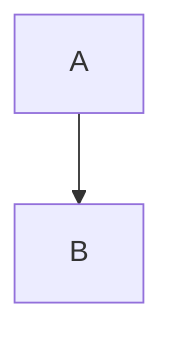
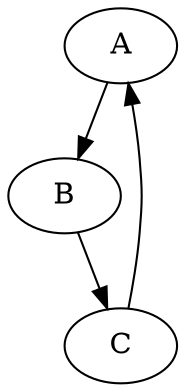

从今天开始，应该就是全面转向使用vscode进行写作了。并且输入法，也变成了使用语音输入和小鹤音形的混合输入方式了。

今天主要想完成的目标是：想出一个办法，如何更多的增加缩进的使用频率，这样可以让文本的格式能够更加丰富。

例如上面这句话就可以改成如下格式：

    今天主要想完成的目标是：
        想出一个办法，使我可以：
            增加缩进格式的使用频率
    这样就可以：
        让文本的格式能够更加丰富。
    主要的问题在于：
        所有其他格式都使用不了了，
        例如，
        连加粗都做不到。
    因为，缩进格式在Markdown中间认为是代码。
    而代码是不会有其他格式的。

**一句话：缩进格式<=！=>使用其他格式**

//*引入“矛盾符号”：“<=！=>”相当于多了一种标点，也挺好的。*

因此解决方法就是：逻辑层次关系比较复杂的长句或长段落就可以使用这种格式。像现在这种，逻辑层次关系比较简单的句子，就可以正常写。

麦克风音量有点小，必须放到完全贴近嘴边，收音效果才会变得比较好，所以以后肯定还是需要买个带有比较好的麦克风的耳机的。现在这种摆在嘴边的状态，非常别扭，让人很不舒服。

另外需要注意的是，即使逻辑层次关系比较复杂，但理解起来却很容易的句子，也不需要这种格式，




```puml
A -> B
```
哈哈，现在可以使用pUML了，简直是太爽了。


超级AI精神病+超高智商犯罪。

感兴趣就不怕啰嗦，不感兴趣连简洁也是啰嗦。

